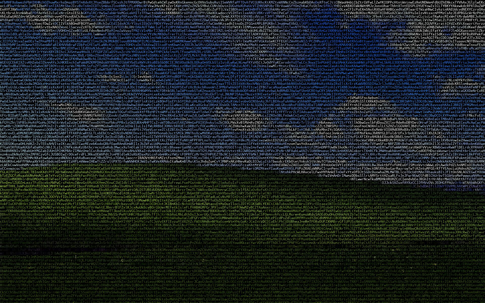

# image 2 something

## 2 bit

## 2 character

## 相关理论
[转字符画](https://www.wdbyte.com/java/char-image.html#_1-%E5%AD%97%E7%AC%A6%E5%9B%BE%E6%A1%88%E6%80%9D%E8%B7%AF)
[边缘向量场](https://blog.csdn.net/weixin_42201701/article/details/103439458)
[画栅格线](https://www.cnpython.com/qa/84805), https://pillow.readthedocs.io/en/stable/reference/ImageDraw.html#PIL.ImageDraw.ImageDraw.line
